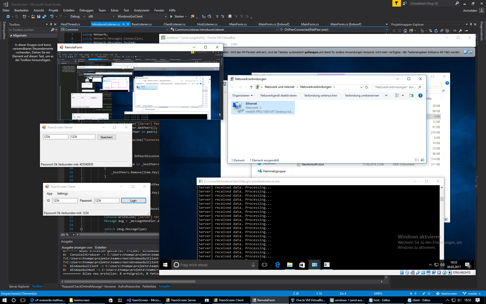

# TeamScreen

It should be an Teamviewer/Vnc/Something replacement

Communication is secured by private/public and symmetric encryption

## ToDo
- Installer
- Windows Service Host
- better Screencapture (capture only what is changed)
- FileManager
- Gui (looks ugly right now)

## Connection Flow

Host and Client are connected to the Introducer

1. "Client" sends an introduce request to the "Host" with his public key
2. "Host" stores the public key and sends an response with his public key to the "Client"
3. "Client" stores the public key from the "Host"
4. "Client" sends an connection request with the password and an generated Symmetric key, which are encrypted by the "Host" public key
5. "Host" decrypt the password and symmetric key with his private key and checks if password is correct.
6. if the password is correct the connection is encrypted with the symmetric key which is only known by the "Client" and "Host"
7. screenshots, keystrokes, filetransfer is secured
8. "Introducer" knows only systemid to proxy the connection between "Client" <-> "Introducer" <-> "Host"
9. no nat issues or direct connection needed between "Client" and "Host"

Screenshot
----------

